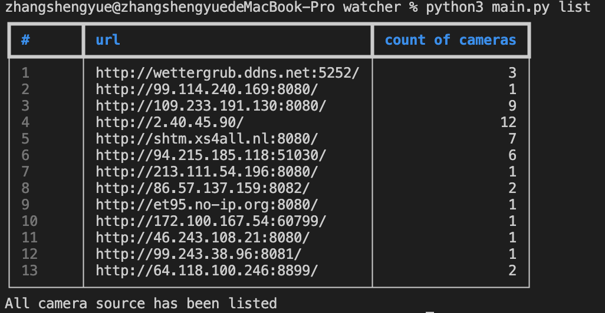
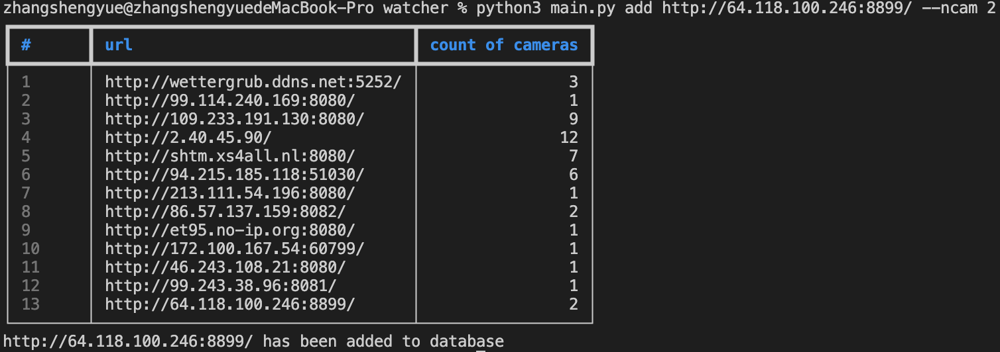

# watcher
## Requirements
* Python 3
* PyQT5
* Python modules listed in _requirements.txt_
## Usage
### list all source url in database
```
python3 main.py list
```

### add source url to database
```
python3 main.py add <url> [--ncam <nCam, default=1>]
```

### remove source url to database
```
python3 main.py remove <url>
```

### show webcam frame stream
```
python3 main.py show <url> [--camno <camNo, default=1>]
```
[](https://www.youtube.com/watch?v=fAkMXMFLvBo)
### multi-view of camera
```
python3 display_all.py
```
[](https://www.youtube.com/watch?v=AI-FLv8Z6DY)